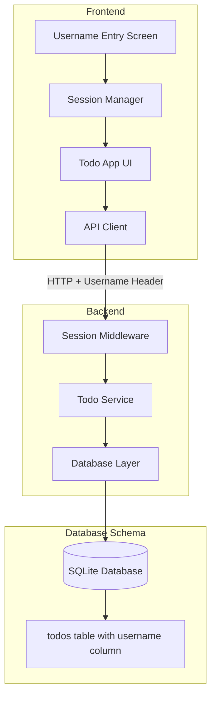
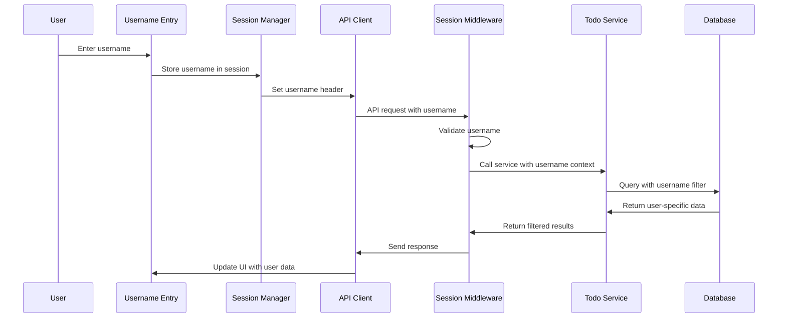

# Design Document: Multi-User Support

## Overview

This design extends the existing todo application to support multiple users through session-based identification. Users will enter a username to establish their session and access only their personal todos. The design maintains the existing RESTful API structure while adding user context to all operations.

The solution uses session-based authentication without passwords, storing the username in browser session storage and passing it via HTTP headers for API requests. This approach provides user isolation while keeping the authentication mechanism simple and lightweight.

## Architecture

### High-Level Architecture



### Component Interaction Flow



## Components and Interfaces

### Frontend Components

#### SessionManager
Manages user session state and username persistence.

```typescript
interface SessionManager {
  getCurrentUsername(): string | null;
  setUsername(username: string): void;
  clearSession(): void;
  hasActiveSession(): boolean;
}
```

#### UsernameEntry Component
Provides the initial username entry interface.

```typescript
interface UsernameEntryProps {
  onUsernameSubmit: (username: string) => void;
  error?: string;
}
```

#### Enhanced API Client
Extended to include username context in all requests.

```typescript
interface UserAwareApiClient extends TodoApiClient {
  setUsername(username: string): void;
  clearUsername(): void;
}
```

### Backend Components

#### Session Middleware
Validates and extracts username from requests.

```typescript
interface SessionMiddleware {
  validateUserSession(request: FastifyRequest): string;
  extractUsername(request: FastifyRequest): string | null;
}
```

#### Enhanced Todo Service
Modified to include user context in all operations.

```typescript
interface UserAwareTodoService {
  getAllTodos(username: string): Promise<Todo[]>;
  createTodo(username: string, data: CreateTodoRequest): Promise<Todo>;
  updateTodo(username: string, id: number, data: UpdateTodoRequest): Promise<Todo>;
  deleteTodo(username: string, id: number): Promise<void>;
}
```

## Data Models

### Enhanced Todo Model
The existing Todo interface remains unchanged for API compatibility:

```typescript
interface Todo {
  id: number;
  text: string;
  completed: boolean;
  createdAt: Date;
  updatedAt: Date;
}
```

### Database Schema Changes
The todos table will be extended with a username column:

```sql
ALTER TABLE todos ADD COLUMN username TEXT NOT NULL DEFAULT '';
CREATE INDEX idx_todos_username ON todos(username);
CREATE INDEX idx_todos_username_completed ON todos(username, completed);
```

### Session Data Model
```typescript
interface UserSession {
  username: string;
  establishedAt: Date;
}
```

### API Request Headers
```typescript
interface ApiHeaders {
  'Content-Type': 'application/json';
  'X-Username': string; // Required for all authenticated requests
}
```
## Correctness Properties

*A property is a characteristic or behavior that should hold true across all valid executions of a system—essentially, a formal statement about what the system should do. Properties serve as the bridge between human-readable specifications and machine-verifiable correctness guarantees.*

### Property 1: Session Establishment
*For any* valid username (1-50 non-whitespace characters), when entered into the session manager, a session should be successfully established and the user interface should navigate to the main application.
**Validates: Requirements 1.2, 1.3, 2.4**

### Property 2: Username Validation
*For any* string that is empty, contains only whitespace, or exceeds 50 characters, the session manager should reject it and prevent session creation.
**Validates: Requirements 2.2, 2.3**

### Property 3: Session Persistence
*For any* established session, the username should persist in browser storage and remain available after page refresh until the session is explicitly cleared.
**Validates: Requirements 1.4, 1.5**

### Property 4: Todo Data Isolation
*For any* user with an active session, all todo operations (create, read, update, delete) should only return or affect todos associated with that user's username, never returning or modifying todos belonging to other users.
**Validates: Requirements 3.2, 3.5, 6.2**

### Property 5: Todo Ownership Association
*For any* todo creation operation, the created todo should be automatically associated with the current user's username and stored with that association in the database.
**Validates: Requirements 3.1, 5.4**

### Property 6: Access Control Enforcement
*For any* attempt to modify or delete a todo, the operation should only succeed if the todo belongs to the requesting user, otherwise returning a not found error.
**Validates: Requirements 3.3, 3.4, 6.3**

### Property 7: Cross-Session Data Persistence
*For any* user, creating todos in one session, ending the session, and starting a new session with the same username should retrieve all previously created todos (round-trip property).
**Validates: Requirements 5.1, 5.2, 5.3**

### Property 8: API Authentication Requirement
*For any* API request to todo endpoints, the request should require a valid username identifier and all operations should be performed within that user's context.
**Validates: Requirements 6.1, 6.4**

### Property 9: Session Cleanup
*For any* active session, when the session is terminated, the session manager should clear all stored username data and return the interface to the username entry screen.
**Validates: Requirements 4.2**

### Property 10: Username Display Consistency
*For any* active session, the user interface should consistently display the current username throughout the application.
**Validates: Requirements 4.4**

## Error Handling

### Frontend Error Handling
- **Invalid Username**: Display clear validation messages for empty, whitespace-only, or too-long usernames
- **Network Errors**: Handle API failures gracefully with retry mechanisms
- **Session Expiry**: Detect when session context is lost and redirect to username entry
- **Unauthorized Access**: Handle 401/403 responses by clearing session and redirecting

### Backend Error Handling
- **Missing Username Header**: Return 401 Unauthorized with clear error message
- **Invalid Username Format**: Return 400 Bad Request with validation details
- **Cross-User Access Attempts**: Return 404 Not Found (not 403) to avoid information leakage
- **Database Errors**: Handle SQLite constraint violations and connection issues

### Error Response Format
```typescript
interface SessionError extends ApiError {
  error: {
    code: 'INVALID_USERNAME' | 'SESSION_REQUIRED' | 'ACCESS_DENIED';
    message: string;
    details?: {
      username?: string;
      validationRules?: string[];
    };
  };
}
```

## Testing Strategy

### Dual Testing Approach
The implementation will use both unit tests and property-based tests to ensure comprehensive coverage:

- **Unit tests**: Verify specific examples, edge cases, and error conditions
- **Property tests**: Verify universal properties across all inputs using randomized testing

### Property-Based Testing Configuration
- **Testing Library**: fast-check for TypeScript/JavaScript property-based testing
- **Test Iterations**: Minimum 100 iterations per property test
- **Test Tagging**: Each property test tagged with format: **Feature: multi-user-support, Property {number}: {property_text}**

### Unit Testing Focus Areas
- Username validation edge cases (empty string, whitespace variations, boundary lengths)
- Session storage and retrieval mechanisms
- API error response handling
- UI component state transitions

### Property Testing Focus Areas
- Username validation across all possible input combinations
- Data isolation across multiple concurrent users
- Session persistence across various browser states
- Cross-session data consistency for all users

### Integration Testing
- End-to-end user flows from username entry to todo management
- Multi-user scenarios with concurrent sessions
- Session cleanup and switching between users
- Database migration and data integrity verification

### Database Testing
- Schema migration validation
- Username indexing performance
- Data isolation at the database query level
- Concurrent user access patterns