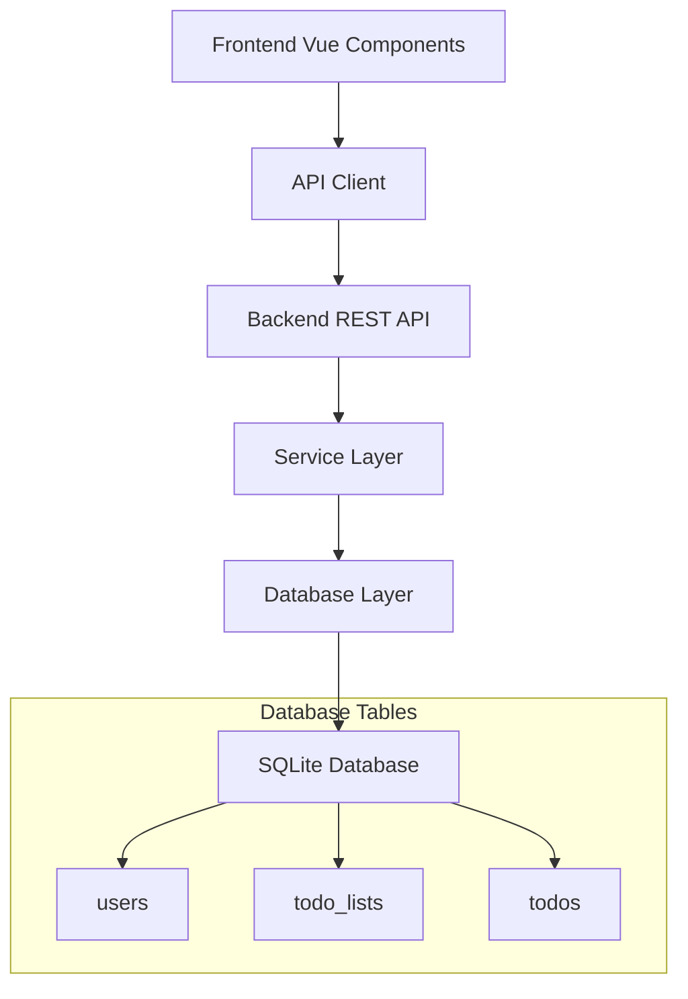

# Design Document

## Overview

This design implements a multi-list todo system with proper user management through database normalization. The system will migrate from a single-table approach to a three-table relational model (users, todo_lists, todos) with proper foreign key constraints to ensure data integrity and enable organized task management.

## Architecture

The system follows a layered architecture with clear separation between data, business logic, and presentation layers:



## Components and Interfaces

### Database Schema

The database will consist of three main tables with proper foreign key relationships:

```sql
-- Users table for user identity management
CREATE TABLE users (
    id INTEGER PRIMARY KEY AUTOINCREMENT,
    username TEXT UNIQUE NOT NULL,
    created_at DATETIME DEFAULT CURRENT_TIMESTAMP
);

-- Todo lists table for organizing todos
CREATE TABLE todo_lists (
    id INTEGER PRIMARY KEY AUTOINCREMENT,
    name TEXT NOT NULL,
    user_id INTEGER NOT NULL,
    created_at DATETIME DEFAULT CURRENT_TIMESTAMP,
    FOREIGN KEY (user_id) REFERENCES users(id) ON DELETE CASCADE,
    UNIQUE(name, user_id) -- Prevent duplicate list names per user
);

-- Todos table with list association
CREATE TABLE todos (
    id INTEGER PRIMARY KEY AUTOINCREMENT,
    text TEXT NOT NULL,
    completed BOOLEAN DEFAULT FALSE,
    list_id INTEGER NOT NULL,
    created_at DATETIME DEFAULT CURRENT_TIMESTAMP,
    FOREIGN KEY (list_id) REFERENCES todo_lists(id) ON DELETE CASCADE
);
```

### TypeScript Interfaces

```typescript
interface User {
    id: number;
    username: string;
    created_at: Date;
}

interface TodoList {
    id: number;
    name: string;
    user_id: number;
    created_at: Date;
    todo_count?: number; // Computed field for UI
}

interface Todo {
    id: number;
    text: string;
    completed: boolean;
    list_id: number;
    created_at: Date;
}

interface TodoWithList extends Todo {
    list_name: string; // For cross-list operations
}
```

### API Endpoints

The REST API will be extended to support list-based operations:

```typescript
// User management
GET    /api/users/:username          // Get or create user
POST   /api/users                    // Create new user

// List management  
GET    /api/users/:userId/lists      // Get all lists for user
POST   /api/users/:userId/lists      // Create new list
PUT    /api/lists/:listId            // Update list (rename)
DELETE /api/lists/:listId            // Delete list and all todos

// Todo management within lists
GET    /api/lists/:listId/todos      // Get todos in specific list
POST   /api/lists/:listId/todos      // Create todo in list
PUT    /api/todos/:todoId            // Update todo (complete/text)
DELETE /api/todos/:todoId            // Delete todo
PUT    /api/todos/:todoId/move       // Move todo to different list
```

### Service Layer Architecture

```typescript
class UserService {
    async getOrCreateUser(username: string): Promise<User>
    async createDefaultList(userId: number): Promise<TodoList>
}

class TodoListService {
    async getListsForUser(userId: number): Promise<TodoList[]>
    async createList(userId: number, name: string): Promise<TodoList>
    async updateListName(listId: number, name: string): Promise<TodoList>
    async deleteList(listId: number): Promise<void>
    async validateListOwnership(listId: number, userId: number): Promise<boolean>
}

class TodoService {
    async getTodosInList(listId: number): Promise<Todo[]>
    async createTodo(listId: number, text: string): Promise<Todo>
    async updateTodo(todoId: number, updates: Partial<Todo>): Promise<Todo>
    async deleteTodo(todoId: number): Promise<void>
    async moveTodoToList(todoId: number, targetListId: number): Promise<Todo>
}
```

## Data Models

### Migration Strategy

The system will implement a database migration to transform the existing single-table structure:

1. **Create new tables** (users, todo_lists, todos)
2. **Migrate existing data** from current todos table
3. **Create default user** for existing todos
4. **Create default list** ("My Tasks") for migrated todos
5. **Drop old table** after successful migration

### Data Relationships

- **Users → TodoLists**: One-to-Many (CASCADE DELETE)
- **TodoLists → Todos**: One-to-Many (CASCADE DELETE)  
- **Users → Todos**: Indirect through TodoLists

### Constraints and Validation

- List names must be unique per user
- Every user must have at least one list
- Todos must belong to exactly one list
- Foreign key constraints enforce referential integrity
- Cascade deletes maintain data consistency

## Correctness Properties

*A property is a characteristic or behavior that should hold true across all valid executions of a system-essentially, a formal statement about what the system should do. Properties serve as the bridge between human-readable specifications and machine-verifiable correctness guarantees.*

### Property 1: User session management
*For any* username, accessing the application should either return an existing user or create a new user, and subsequent access should return the same user with their lists preserved
**Validates: Requirements 1.2, 1.4**

### Property 2: List name validation  
*For any* string composed entirely of whitespace or empty content, attempting to create a list should be rejected
**Validates: Requirements 2.1**

### Property 3: List name uniqueness per user
*For any* user, attempting to create or rename a list to a name that already exists for that user should be rejected
**Validates: Requirements 2.2, 3.4**

### Property 4: Unique identifier generation
*For any* sequence of list creation operations, all generated list IDs should be unique
**Validates: Requirements 2.3**

### Property 5: Data ownership and filtering
*For any* user, all operations (list queries, todo queries, list creation) should only return or affect data belonging to that user
**Validates: Requirements 1.3, 2.4, 3.3, 4.2, 4.3**

### Property 6: List renaming preserves todos
*For any* list with todos, renaming the list should preserve all todos with their original content and completion status
**Validates: Requirements 3.1**

### Property 7: Cascade deletion behavior
*For any* user or list deletion, all dependent data (lists for users, todos for lists) should be automatically removed
**Validates: Requirements 3.2, 6.2**

### Property 8: Todo list requirement
*For any* todo creation request, the operation should fail if no valid list ID is provided
**Validates: Requirements 4.1**

### Property 9: Todo movement preservation
*For any* todo moved between lists, the todo's text and completion status should remain unchanged while the list association updates correctly
**Validates: Requirements 4.4, 4.5**

### Property 10: Todo count accuracy
*For any* list, the reported todo count should exactly match the number of todos actually belonging to that list
**Validates: Requirements 5.5**

### Property 11: Default list creation
*For any* new user creation, a default list named "My Tasks" should be automatically created
**Validates: Requirements 7.1**

### Property 12: Minimum list invariant
*For any* user at any time, they should have at least one list, and attempting to delete the last remaining list should be prevented
**Validates: Requirements 7.2, 7.3**

### Property 13: Default list equality
*For any* user's default list, it should support all the same operations (renaming, adding todos) as any other list
**Validates: Requirements 7.4**

## Error Handling

The system implements comprehensive error handling across all layers:

### Database Level
- Foreign key constraint violations return appropriate error codes
- Unique constraint violations are caught and converted to user-friendly messages
- Transaction rollbacks ensure data consistency on failures

### API Level
- Input validation with detailed error messages
- Proper HTTP status codes (400 for validation, 404 for not found, 403 for unauthorized)
- Structured error responses with error codes and descriptions

### Service Level
- Business rule validation (minimum list requirement, ownership checks)
- Graceful handling of edge cases (empty lists, non-existent resources)
- Atomic operations to prevent partial state changes

### Frontend Level
- Loading states during API operations
- User-friendly error messages for common scenarios
- Optimistic updates with rollback on failure

## Testing Strategy

The testing approach combines unit tests for specific scenarios with property-based tests for comprehensive validation:

### Unit Testing
- **API endpoint tests**: Verify correct request/response handling for each endpoint
- **Service layer tests**: Test business logic with specific examples and edge cases
- **Database migration tests**: Ensure data migration preserves existing todos correctly
- **Error condition tests**: Verify proper error handling for invalid inputs and edge cases

### Property-Based Testing
- **Minimum 100 iterations** per property test to ensure comprehensive input coverage
- **QuickCheck-style testing** using a TypeScript property testing library (fast-check)
- **Each property test** references its corresponding design document property
- **Tag format**: `Feature: todo-lists, Property {number}: {property_text}`

### Integration Testing
- **End-to-end API flows**: Test complete user journeys from list creation to todo management
- **Database integrity tests**: Verify foreign key constraints and cascade behaviors work correctly
- **Migration testing**: Ensure smooth transition from single-table to multi-table structure

### Test Configuration
Property-based tests will be configured with:
```typescript
// Example property test structure
describe('Feature: todo-lists, Property 5: Data ownership and filtering', () => {
  it('should only return data belonging to the requesting user', 
    fc.property(fc.array(fc.record({...})), async (testData) => {
      // Test implementation with 100+ iterations
    }), { numRuns: 100 }
  );
});
```

The dual testing approach ensures both concrete correctness (unit tests) and universal correctness (property tests), providing comprehensive validation of the todo-lists feature.