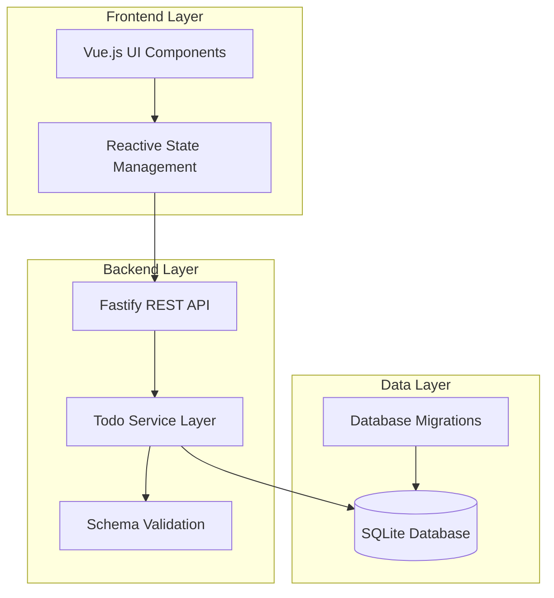

# Design Document: Todo Management System

## Overview

This document outlines the design for a full-stack todo management application built with TypeScript. The system consists of a Vue.js frontend communicating with a Fastify backend that persists data in an SQLite database. The architecture emphasizes type safety, performance, and maintainability while providing a responsive user experience for managing personal todo items.

## Architecture

The application follows a three-tier architecture:



**Communication Flow:**
1. User interactions trigger Vue component methods
2. Components call reactive store methods
3. Store methods make HTTP requests to Fastify API
4. API routes delegate to service layer for business logic
5. Service layer performs database operations via SQLite
6. Responses flow back through the same layers

## Components and Interfaces

### Backend Components

**Database Schema:**
```sql
CREATE TABLE todos (
    id INTEGER PRIMARY KEY AUTOINCREMENT,
    text TEXT NOT NULL CHECK(length(trim(text)) > 0),
    completed BOOLEAN NOT NULL DEFAULT 0,
    created_at DATETIME NOT NULL DEFAULT CURRENT_TIMESTAMP,
    updated_at DATETIME NOT NULL DEFAULT CURRENT_TIMESTAMP
);

CREATE INDEX idx_todos_completed ON todos(completed);
CREATE INDEX idx_todos_created_at ON todos(created_at);
```

**Core Interfaces:**
```typescript
interface Todo {
  id: number;
  text: string;
  completed: boolean;
  createdAt: Date;
  updatedAt: Date;
}

interface CreateTodoRequest {
  text: string;
}

interface UpdateTodoRequest {
  completed: boolean;
}

interface TodoService {
  getAllTodos(): Promise<Todo[]>;
  createTodo(data: CreateTodoRequest): Promise<Todo>;
  updateTodo(id: number, data: UpdateTodoRequest): Promise<Todo>;
  deleteTodo(id: number): Promise<void>;
}
```

**Fastify Route Schemas:**
```typescript
const todoSchemas = {
  getTodos: {
    response: {
      200: {
        type: 'array',
        items: { $ref: 'todo#' }
      }
    }
  },
  createTodo: {
    body: {
      type: 'object',
      required: ['text'],
      properties: {
        text: { type: 'string', minLength: 1, maxLength: 500 }
      }
    },
    response: {
      201: { $ref: 'todo#' }
    }
  },
  updateTodo: {
    params: {
      type: 'object',
      required: ['id'],
      properties: {
        id: { type: 'integer', minimum: 1 }
      }
    },
    body: {
      type: 'object',
      required: ['completed'],
      properties: {
        completed: { type: 'boolean' }
      }
    },
    response: {
      200: { $ref: 'todo#' }
    }
  },
  deleteTodo: {
    params: {
      type: 'object',
      required: ['id'],
      properties: {
        id: { type: 'integer', minimum: 1 }
      }
    },
    response: {
      204: { type: 'null' }
    }
  }
};
```

### Frontend Components

**Vue Component Structure:**
```typescript
// TodoApp.vue - Main application component
interface TodoAppState {
  todos: Todo[];
  loading: boolean;
  error: string | null;
}

// TodoList.vue - Displays list of todos
interface TodoListProps {
  todos: Todo[];
  onToggle: (id: number) => void;
  onDelete: (id: number) => void;
}

// TodoItem.vue - Individual todo item
interface TodoItemProps {
  todo: Todo;
  onToggle: (id: number) => void;
  onDelete: (id: number) => void;
}

// TodoForm.vue - Form for creating new todos
interface TodoFormState {
  text: string;
  submitting: boolean;
}

interface TodoFormEmits {
  submit: (text: string) => void;
}
```

**API Client Interface:**
```typescript
interface TodoApiClient {
  getTodos(): Promise<Todo[]>;
  createTodo(text: string): Promise<Todo>;
  updateTodo(id: number, completed: boolean): Promise<Todo>;
  deleteTodo(id: number): Promise<void>;
}
```

## Data Models

**Todo Entity:**
- **id**: Auto-incrementing primary key for unique identification
- **text**: Todo description with validation (1-500 characters, non-empty when trimmed)
- **completed**: Boolean flag indicating completion status
- **createdAt**: Timestamp of todo creation (immutable)
- **updatedAt**: Timestamp of last modification (updated on changes)

**Database Constraints:**
- Text field cannot be empty or contain only whitespace
- Completed field defaults to false for new todos
- Timestamps are automatically managed by database triggers
- Indexes on completed and created_at fields for query optimization

**API Response Format:**
```typescript
// Success Response
interface ApiResponse<T> {
  data: T;
  success: true;
}

// Error Response
interface ApiError {
  error: {
    message: string;
    code: string;
    details?: any;
  };
  success: false;
}
```

## Correctness Properties

*A property is a characteristic or behavior that should hold true across all valid executions of a system—essentially, a formal statement about what the system should do. Properties serve as the bridge between human-readable specifications and machine-verifiable correctness guarantees.*

Now I need to analyze the acceptance criteria to determine which ones can be tested as properties:

Based on the prework analysis and property reflection, the following correctness properties ensure the system behaves correctly:

**Property 1: Todo Creation Correctness**
*For any* valid todo description, creating a todo should result in a new database record with a unique ID, the provided text, completed status set to false, and proper timestamps, and the response should contain the complete todo object.
**Validates: Requirements 1.1, 1.3, 1.4**

**Property 2: Input Validation Consistency**
*For any* invalid todo input (empty strings, whitespace-only strings, or malformed data), the system should reject the request and return descriptive error messages with appropriate HTTP status codes.
**Validates: Requirements 1.2, 7.1**

**Property 3: Todo Retrieval Completeness**
*For any* set of todos in the database, retrieving the todo list should return exactly those todos with all required fields (id, text, completed, timestamps) in the correct order (incomplete first, then completed).
**Validates: Requirements 2.1, 2.2, 2.4**

**Property 4: Status Toggle Correctness**
*For any* existing todo, toggling its completion status should immediately update the database record, set the completed field to the new value, update the timestamp, and persist the change.
**Validates: Requirements 3.1, 3.2, 3.3**

**Property 5: Todo Deletion Correctness**
*For any* existing todo, deleting it should permanently remove it from the database, return a success confirmation, and ensure it no longer appears in subsequent queries.
**Validates: Requirements 4.1, 4.4**

**Property 6: Non-existent Resource Handling**
*For any* operation on a non-existent todo ID, the system should return appropriate error responses with correct HTTP status codes and descriptive error messages.
**Validates: Requirements 4.3**

**Property 7: Database Error Handling**
*For any* database operation failure, the system should handle the error gracefully, log appropriate error information, and return user-friendly error responses without exposing internal details.
**Validates: Requirements 5.4, 7.2**

**Property 8: API Input Validation**
*For any* API endpoint receiving invalid requests (malformed JSON, missing required fields, invalid data types), the system should return appropriate HTTP status codes and descriptive error messages.
**Validates: Requirements 6.5**

**Property 9: UI State Consistency**
*For any* data change operation (create, update, delete), the user interface should immediately reflect the change and maintain consistency with the backend state.
**Validates: Requirements 3.4, 4.2**

**Property 10: Network Error Handling**
*For any* network request failure in the frontend, the UI should display appropriate error messages to inform the user of the issue without crashing or becoming unresponsive.
**Validates: Requirements 7.3**

## Error Handling

The system implements comprehensive error handling at multiple layers:

**Database Layer:**
- Connection failures: Retry logic with exponential backoff
- Constraint violations: Descriptive error messages for validation failures
- Transaction failures: Automatic rollback and error reporting
- File system errors: Graceful handling of permission and disk space issues

**API Layer:**
- Input validation: JSON schema validation with detailed error messages
- Authentication errors: Proper HTTP status codes (401, 403)
- Resource not found: 404 responses with helpful error messages
- Server errors: 500 responses with sanitized error information

**Frontend Layer:**
- Network failures: Retry mechanisms and user-friendly error messages
- Loading states: Visual indicators during async operations
- Validation errors: Real-time feedback on form inputs
- Graceful degradation: Fallback UI states when features are unavailable

**Error Response Format:**
```typescript
interface ErrorResponse {
  success: false;
  error: {
    code: string;           // Machine-readable error code
    message: string;        // Human-readable error message
    field?: string;         // Field name for validation errors
    details?: any;          // Additional error context (dev mode only)
  };
}
```

## Testing Strategy

The testing approach combines unit tests for specific scenarios with property-based tests for comprehensive validation:

**Unit Testing:**
- **API Endpoints**: Test each REST endpoint with valid and invalid inputs
- **Database Operations**: Test CRUD operations with edge cases
- **Vue Components**: Test user interactions and state management
- **Error Scenarios**: Test specific error conditions and edge cases
- **Integration Points**: Test frontend-backend communication

**Property-Based Testing:**
- **Library**: Use `fast-check` for TypeScript property-based testing
- **Configuration**: Minimum 100 iterations per property test
- **Coverage**: Each correctness property implemented as a property-based test
- **Generators**: Smart input generators that create realistic test data
- **Tagging**: Each test tagged with format: **Feature: todo-management, Property N: [property description]**

**Test Organization:**
```
tests/
├── unit/
│   ├── api/           # API endpoint tests
│   ├── services/      # Business logic tests
│   ├── components/    # Vue component tests
│   └── utils/         # Utility function tests
├── integration/
│   ├── database/      # Database integration tests
│   └── api/           # Full API integration tests
└── properties/
    ├── todo-crud.property.test.ts
    ├── validation.property.test.ts
    └── error-handling.property.test.ts
```

**Testing Guidelines:**
- Unit tests focus on specific examples, edge cases, and error conditions
- Property tests verify universal behaviors across all valid inputs
- Integration tests validate component interactions and data flow
- All tests must be deterministic and independent
- Database tests use isolated test databases
- Frontend tests use mocked API responses for unit tests, real API for integration tests